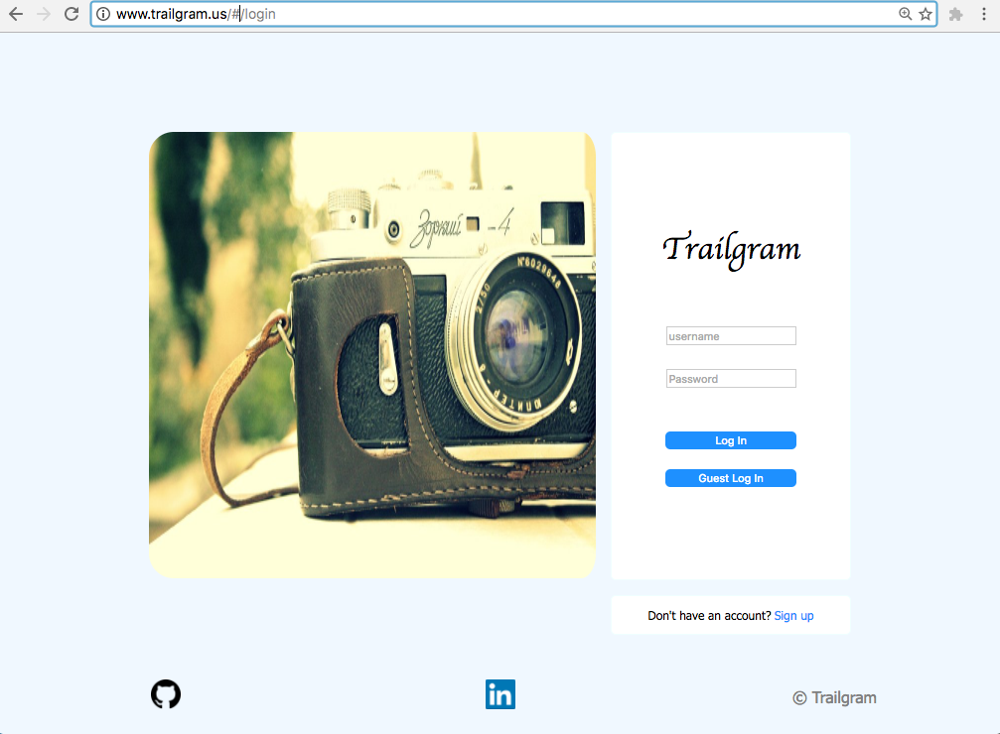
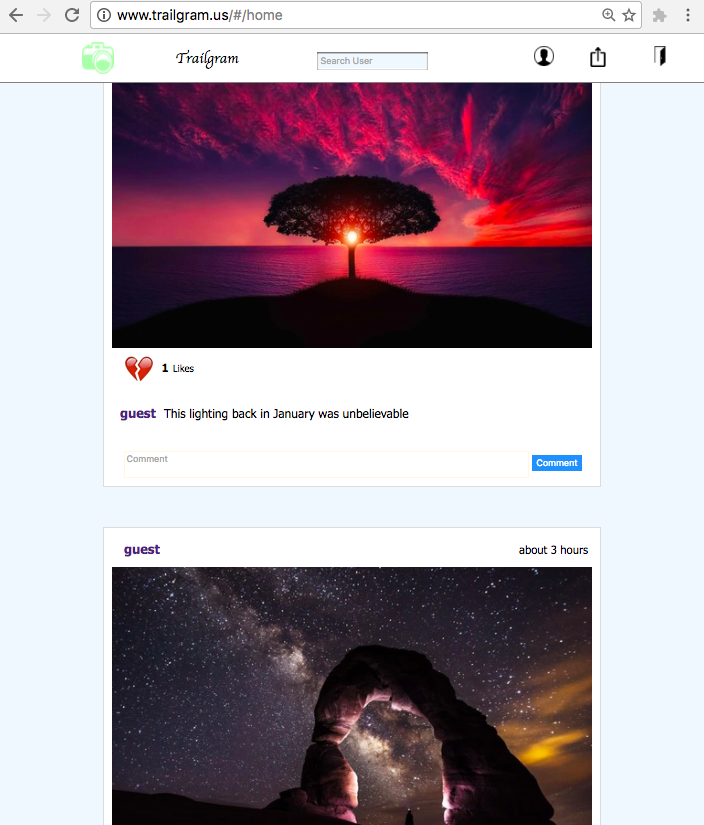
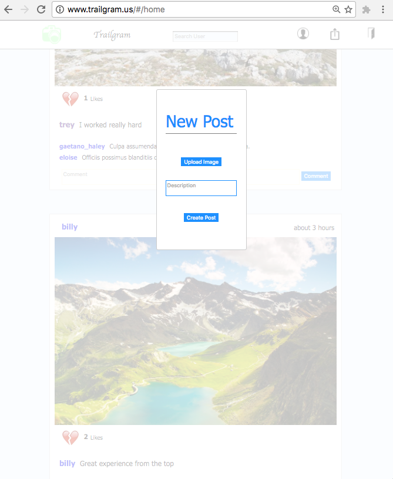
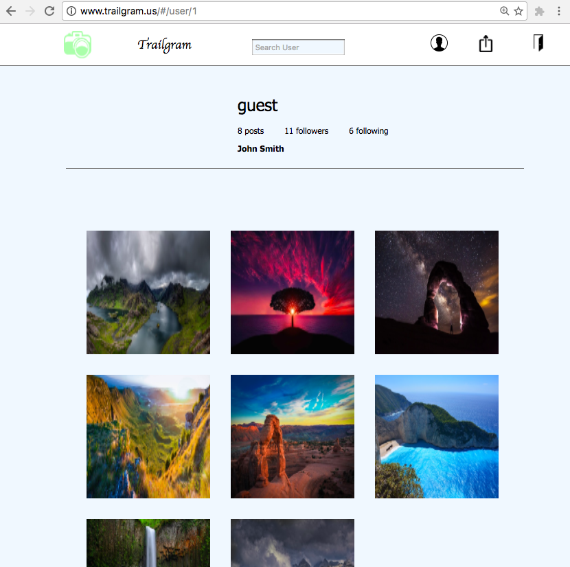
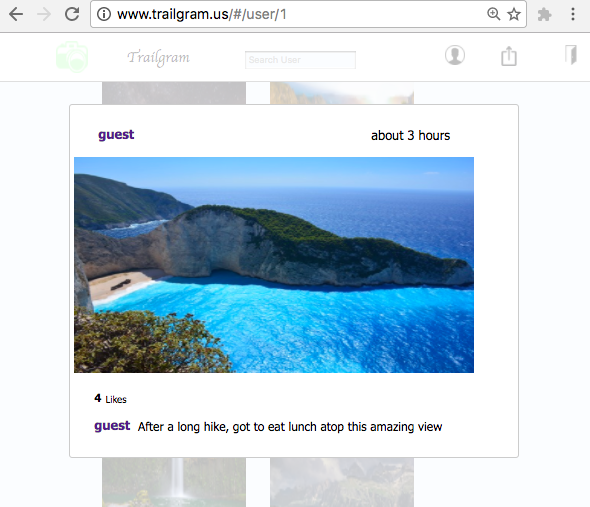

# TrailGram

[TrailGram](http://www.trailgram.us/) is a single page application that provides an easy way for users to share and store their pictures of different hikes from around the world.  TrailGram is a full stack web app that uses Ruby on Rails for its backend, PostgreSQL for a database and React/Redux for the frontend.

### Authentication

##### Features
- User verification
- Keeps users logged in through any refresh or redirect
- Users must be logged in to use the application

User authentication is handled by both the frontend as well as the backend and allows each logged in user to experience everything that TrailGram has to offer.

### Implemented Features

#### Posts

Features

- Users can upload photos
- Posts automatically displayed on main page of all "followed" Users
- Users can view "unfollowed" posts by viewing others profile pages through the search bar

Implementation

Post images are stored on the cloudinary server.  The posts displayed on the home page are all the posts of whom the current user is following as well as their own posts.

##### Comments

Features

- Users can create comments on any post on the home page

Implementation

Comments are stored on each post in the backend as part of a join table in the database.

##### Likes

Features

- Users can like any post on the home page or profile page
- Users can also unlike a post that they previously liked
- Total number of likes are displayed for each post

Implementation

Users can click the broken heart to like or the full heart to unlike a post which is saved in a join table so each post has an array of like objects.

##### Search

Features

- Users can always search for other users by username
- Clicking on a username based on the search results drop down will navigate to that user's profile page.

Implementation

Once some information is rendered in the search bar, an AJAX request is sent to find all users with a similar username as the search parameter.  It will return all users who match the criteria.

#### Profile

Features

- Users can navigate to other user's profile pages
- Displays all the posts of the specific user
- Displays the number of posts, followers and followings

Implementation

User profile is where a user must go to follow or unfollow another user.  Once a user navigates to another user's profile page, that user's posts are displayed.  Each picture in the profile can be clicked on to bring up a modal of the post.

##### Follows

Features

- A user can "follow" another user which will instantly show all of that user's posts on the homepage feed.
- A user can "unfollow" any user they are currently following.

Implementation

Follows are stored on the backend as part of a join table between the users.  A button will be shown for each profile that does not match the current user.
